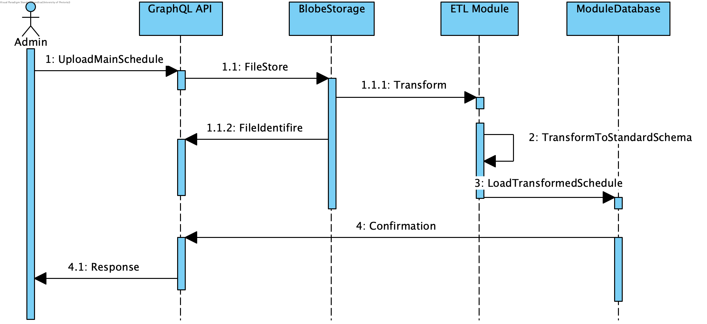

# Component Design
### 1. Authentication and Authorization 
##### Sequence Diagram

### 2. File Upload
#### A. Campus Map
##### Sequence Diagram

#### B. Transform Schedule to Standard Schema
##### Sequence Diagram

### 3. Notifications and Reminders
##### Sequence Diagram

## High level System Architecture and Cloud Infrastructure
